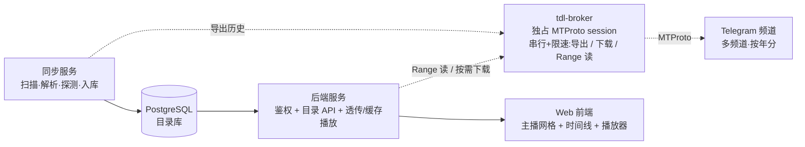
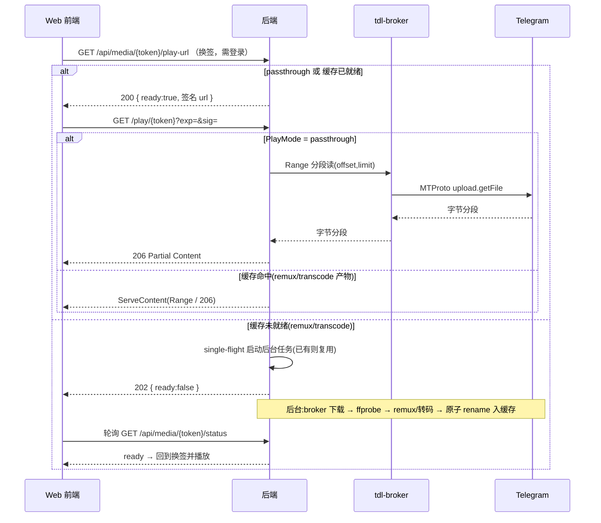

# 主播录播归档系统 · 架构设计

## 1. 背景与目标

我们把多名主播的直播录播上传到了 Telegram 频道(按年份分到不同频道),现在要做一个系统,让这些录播能被**浏览和在线播放**,而不必把全部视频长期落地存储。

核心目标:

- **存储开销可控**:不全量下载所有视频,按需拉取 + 容量受限的缓存。
- **网页访问**:浏览器直接播放,不依赖第三方媒体软件,不依赖原生客户端。
- **以主播为中心浏览**:用户按主播找录播,频道/年份只是后台的物理分区,对用户透明。
- **可扩展**:新增一年录播 = 配置一个新频道 + 跑一次同步。
- **全站密码保护**:本系统为个人自用,所有页面与 API 必须经过单一访问密码门禁,未登录不可见任何资源。

非目标(本期不做):多用户权限体系(但提供单用户密码门禁,见 §13)、原生 TV/移动端 App、复杂推荐。

## 2. 关键设计决策

设计过程中逐步收敛,最终放弃了两个早期方案,理由记录如下,供回顾:

| 决策         | 选择                              | 放弃的方案                  | 原因                                                         |
| ------------ | --------------------------------- | --------------------------- | ------------------------------------------------------------ |
| 媒体服务器   | 自建网页播放                      | Emby                        | Emby 带来 `.strm`/`.nfo`/封面文件生成、目录命名、扫描触发等一整套迁就成本;自有内容 + 网页访问场景下,这些都是负担。目录直接由数据库渲染更简单。 |
| 媒体获取方式 | **混合**:可直接播的走 MTProto Range 流式透传;其余下载 + 归一化 + 缓存 | 纯下载缓存 / 纯自研流式网关 | 纯下载方案对数 GB 录播有严重首播延迟与 2x 磁盘峰值;纯流式网关要为所有格式实现归一化太重。折中:已是 faststart 的 mp4(H.264/AAC,频道内主体)直接透传 Telegram 字节流,零落盘、近零首播延迟;flv/ts/HEVC 等浏览器不能直接播的少数,才下载、归一化、缓存。 |
| Telegram 接入 | 单一 **tdl-broker** 服务(独占 MTProto session) | sync/backend 各自直连 tdl | 两进程共用一份 session 有并发写损坏与 FLOOD_WAIT 风险;收敛为单进程串行 + 统一限速退避。流式透传所需的 Range 分段读 tdl CLI 不暴露,由 broker 基于 MTProto 库(gotd,tdl 亦构建于其上)实现。 |
| 播放兼容性   | 归一化为 MP4(H.264/AAC),透传内容本就是 | 客户端 flv.js / mpegts.js   | 客户端库在 iOS Safari 的 MSE 支持不稳;透传的 mp4 与归一化产物前端都只面对 MP4,一个 `<video>` 通杀所有设备。 |

**主要取舍**:

- 主体内容(faststart mp4)走流式透传,**首播延迟基本消除**、不占缓存;代价是每次播放都回源 Telegram,依赖 broker 的限速与稳定性(热门内容可选缓存,见 §8、§12)。
- 仅 flv/ts/HEVC 等少数格式仍有**首播延迟**(需下载 + 归一化):remux(flv/ts)秒级;真转码(HEVC)较慢,靠同步流后台预热缓解。因内容自有、数量有界,预热可行。
- 引入透传后部分采用了曾放弃的"自研 MTProto 网关",但范围收敛为一个**薄的 Range 代理**(不做归一化),工作量可控。

## 3. 总体架构



系统由两条独立的数据流构成,二者对 Telegram 的访问都收敛到 **tdl-broker**:

- **目录流(定时、离线)**:同步服务经 broker 导出频道历史,解析文件名,**探测容器/编码/faststart** 以预先定下播放模式,把元数据写入 PostgreSQL。它只写库 + 存缩略图,**不生成任何媒体文件**。
- **播放流(实时、按需)**:用户在网页点播,后端按 `PlayMode` 分流——`passthrough` 经 broker Range 透传不落盘;`remux/transcode` 命中缓存则静态直出,未命中则触发**异步**下载归一化,前端轮询就绪后播放(见 §4.3、§13.4)。

## 4. 组件设计

### 4.1 同步服务(Sync)

定时任务(cron 或常驻 daemon),所有 Telegram 访问经 broker,职责:

1. 遍历 `Channels` 表里 `Enabled = true` 的频道。
2. **增量导出**:以该频道已入库的最大 `MessageId` 为 offset,只拉新消息(经 broker 导出,得到 message_id、文件名、上传时间、大小),避免每次重扫整段历史。
3. **周期性全量对账**(默认每日一次或每 N 次同步一次):全量导出一次,与库内 `(ChannelId, MessageId)` 做 diff,检出**被删除**的旧消息(增量 offset 模式天然看不到旧消息删除),标 `Status='deleted'`。
4. 解析文件名 → `Streamer` / `RecordedAt`(见 §6),命中别名表则回填 `StreamerId`(见 §5)。
5. **探测播放模式**:对新条目读取 Telegram document 属性(优先)或经 broker 拉文件头探测容器/视频编码/音频编码/faststart,定下 `PlayMode`(passthrough / remux / transcode),写入 §5 的探测字段。
6. 拉取缩略图(优先用 document 自带 thumb;否则 ffmpeg 抽帧)。**批量限速**:几千条逐个下封面易触发 FLOOD_WAIT,经 broker 串行 + 退避,或分批补齐。
7. UPSERT 进 PG,设置 `Status`;对 `PlayMode='transcode'` 的条目入**预热队列**(见 §8)。

新增一年录播,只需往 `Channels` 插一行再跑一次同步。

### 4.2 目录库(PostgreSQL)

两条流的交汇点,系统唯一的真相源。表结构见 §5。

### 4.3 后端服务(Backend)

两个职责合在一个服务里:

**目录 API**:读 PG,对外提供主播列表、某主播的录播时间线、搜索等接口。

**流式/缓存播放服务**:对外暴露 `GET /play/{token}`(需签名,见 §13.4)。按同步期探测得到的 `PlayMode` 三路分流:

- `passthrough`(faststart mp4 / H.264·AAC):不落盘,把浏览器 `Range` 请求翻译成 broker 的 MTProto 分段读(offset/limit 对齐 1MB 边界),边读边以 206 回传。
- `remux`(flv/ts):需下载 + 换壳;首次播放触发,秒级完成,产物入缓存。
- `transcode`(HEVC 等):需下载 + 真转码,耗时长,**异步**处理,不阻塞 HTTP 请求。



旁挂三个常驻组件:LRU 协程管理缓存总量(见 §8)、**single-flight 表**防同一文件被并发请求重复下载、**转码 worker 池**限制 ffmpeg 并发以免饿死目录 API(见 §9)。

### 4.4 Web 前端(Frontend)

三级页面:

1. **主播网格**:主播头像/名 + 录播数量。
2. **主播时间线**:该主播的所有录播按 `RecordedAt` 排序,**自动跨年份/频道合并**。
3. **播放页**:先调换签接口拿签名 URL;若返回 `ready` 则直接 `<video src="/play/{token}?exp=&sig=">`(passthrough 与缓存命中均如此,浏览器原生处理缓冲与拖动);若返回 `202 preparing`(remux/transcode 冷启动),展示"准备中"并轮询 `/api/media/{token}/status`,就绪后再换签播放。

### 4.5 Telegram 接入代理(tdl-broker)

独占唯一一份 MTProto session 的常驻服务,是系统对 Telegram 的**单一出口**,串行化所有访问并统一限速/退避,规避多进程共享 session 的并发写损坏与 FLOOD_WAIT。对内提供三类能力:

1. **历史导出**:供同步服务做增量/全量拉取。
2. **整文件下载**:供 remux/transcode 冷路径取源文件。
3. **Range 分段读**:`read(channel, message, offset, limit)`,供 passthrough 透传;offset/limit 对齐 MTProto 的 1MB 分块约束,内部按需循环取块。

实现要点:`file_reference` 由 broker 在每次访问时实时解析并在过期时自动重试,不持久化;并发上限 + 令牌桶限速 + 指数退避集中在此一处;登录/会话管理见 §14。Range 读能力 tdl CLI 不暴露,broker 基于底层 MTProto 库(gotd)实现。

## 5. 数据模型

```sql
-- 频道配置：每个频道对应一年（或一组）录播
CREATE TABLE Channels (
    ChannelId  BIGINT  PRIMARY KEY,         -- Telegram 频道 id
    Label      TEXT    NOT NULL,            -- 比如 "2024"
    Enabled    BOOLEAN NOT NULL DEFAULT true
);

-- 录播条目：目录与播放的核心表
CREATE TABLE TelegramMedia (
    Id           BIGINT GENERATED ALWAYS AS IDENTITY PRIMARY KEY,
    ChannelId    BIGINT      NOT NULL REFERENCES Channels(ChannelId),
    MessageId    BIGINT      NOT NULL,
    FileName     TEXT        NOT NULL,                 -- 原始 Telegram 文件名（带冒号）
    FileSize     BIGINT      NOT NULL,
    MimeType     TEXT,
    DurationSec  INT,
    Streamer     TEXT,                                 -- 解析得出的原始名
    StreamerId   BIGINT      REFERENCES Streamers(Id), -- 规范化后回填;未启用别名表时为 NULL，见说明
    RecordedAt   TIMESTAMPTZ,                          -- 解析得出，排序/展示用
    UploadedAt   TIMESTAMPTZ NOT NULL,                 -- 消息上传时间，用于增量 diff
    StreamToken  TEXT        NOT NULL UNIQUE,          -- 资源稳定 ID;须密码学随机(防枚举);播放需登录后换签名 URL,见 §13.4

    -- 探测结果（同步期写入，决定播放路径）
    Container    TEXT,                                 -- mp4 / flv / ts
    VideoCodec   TEXT,                                 -- h264 / hevc / ...
    AudioCodec   TEXT,                                 -- aac / ...
    Faststart    BOOLEAN,                              -- mp4 的 moov 是否在前
    PlayMode     TEXT,                                 -- passthrough / remux / transcode（探测后定）

    -- 缓存/媒体状态（与目录状态正交）
    CacheState   TEXT        NOT NULL DEFAULT 'none',  -- none/preparing/ready/failed（passthrough 恒为 none）
    CachePath    TEXT,                                 -- 归一化产物落盘路径（remux/transcode 就绪后）
    LastError    TEXT,                                 -- 下载/转码失败原因，供前端与运维排查

    ThumbPath    TEXT,
    Status       TEXT        NOT NULL DEFAULT 'pending', -- 目录状态：pending/ready/unparsed/stale/deleted
    CreatedAt    TIMESTAMPTZ NOT NULL DEFAULT now(),
    UpdatedAt    TIMESTAMPTZ NOT NULL DEFAULT now(),
    UNIQUE (ChannelId, MessageId)                      -- message_id 仅频道内唯一
);

-- 主查询是“某主播的录播按时间排”，此索引直接覆盖
CREATE INDEX ix_media_streamer_time ON TelegramMedia (Streamer, RecordedAt);
-- 启用规范化后按 StreamerId 查
CREATE INDEX ix_media_streamerid_time ON TelegramMedia (StreamerId, RecordedAt);

-- 可选：主播规范化，处理同一主播跨频道命名不一致
CREATE TABLE Streamers (
    Id          BIGINT GENERATED ALWAYS AS IDENTITY PRIMARY KEY,
    DisplayName TEXT NOT NULL,
    Avatar      TEXT
);
CREATE TABLE StreamerAlias (
    Alias      TEXT   PRIMARY KEY,                     -- 文件名里出现的原始主播名
    StreamerId BIGINT NOT NULL REFERENCES Streamers(Id)
);
```

说明:

- **不存 Telegram 的 `file_reference`**:它会过期,由 broker 在访问时实时解析,不该持久化。
- `StreamToken` 仅作为**资源内部 ID**(避免暴露 `MessageId`/物理路径),**必须密码学随机生成**(如 16+ 字节 `crypto/rand` 转 base64url);若用自增/可预测值则防枚举形同虚设。它不是播放凭证——播放需登录用户用它向 API 换取一次性签名 URL,详见 §13.4。
- **两套状态正交**:`Status` 是目录状态(能否在列表里出现);`CacheState` 是媒体就绪状态(冷启动是否要等)。一条 `Status='ready'` 的记录总是可点播,只是 `PlayMode≠passthrough` 且 `CacheState≠ready` 时会先走 §4.3 的异步准备。
- **StreamerId 从一开始就留列**:即便首期只 `GROUP BY Streamer`,预留可空 FK,启用别名表时回填即可,避免日后给所有查询加 join、改索引。`Streamers`/`StreamerAlias` 在命名一致前可暂不建(此时 `StreamerId` 恒 NULL)。建表顺序上 `Streamers` 需先于此表创建,或用可延迟约束。
- **不引入用户表**:单用户密码门禁,session 走 HMAC 无状态 cookie(见 §13.2),无需 `Users`/`Sessions` 表。

跨年合并的目录查询(未启用规范化时按原始名;启用后改用 `StreamerId`):

```sql
SELECT * FROM TelegramMedia
WHERE Streamer = $1 AND Status = 'ready'
ORDER BY RecordedAt;     -- 不同频道/年份自动连成一条时间线
```

## 6. 文件名解析规范

上传命名约定:`{streamer}-%Y-%m-%d %H:%M:%S`(可能带扩展名)。

**坑**:分隔主播与日期用的是 `-`,日期内部也是 `-`,不能简单 split。正则应锚定结尾的时间戳,前面贪婪匹配主播名:

```python
import re
from datetime import datetime

PATTERN = re.compile(
    r'^(?P<streamer>.+)-(?P<ts>\d{4}-\d{2}-\d{2} \d{2}:\d{2}:\d{2})(?:\.\w+)?$'
)

m = PATTERN.match(original_filename)   # 用原始 Telegram 文件名，不是落盘后的名字
if m:
    streamer = m.group('streamer')
    recorded_at = datetime.strptime(m.group('ts'), '%Y-%m-%d %H:%M:%S')
else:
    pass  # 标记 Status='unparsed'，留待人工归类，不要静默丢弃
```

规则:

1. **在原始文件名上解析**。`%H:%M:%S` 含冒号,在 Windows/NTFS 非法,落盘时会经 filenamify 替换;缓存文件按 message_id 或哈希命名,与展示名解耦。
2. **解析失败标记不丢**:`Status='unparsed'`,留待人工归类。
3. **时区必须显式钉定**。文件名里的时间戳是裸时间(无时区),解析成 `TIMESTAMPTZ` 前必须按约定时区(配置项,如录制机所在的 `Asia/Shanghai`)解释,而不是依赖服务器本地时区。否则跨频道合并时间线会因服务器时区/DST 不同而错排。

## 7. 媒体归一化

频道内现有格式:`mp4 / flv / ts`。HTML5 `<video>` 原生不能播 flv 和裸 ts,但三者内部编码绝大多数是 H.264 + AAC,只是容器不同。同步期探测(§4.1)即可把每条录播归入三类 `PlayMode`,播放期不再临时判断:

| PlayMode | 命中条件 | 处理 | 落盘 |
| --- | --- | --- | --- |
| `passthrough` | mp4 + H.264/AAC + **moov 在前(faststart)** | broker Range 透传,前端直接播 | 否 |
| `remux` | flv / ts(或 moov 在后的 mp4)+ H.264/AAC | 下载后 `-c copy` 换壳为 faststart mp4 | 是(入缓存) |
| `transcode` | 浏览器不认的编码(HEVC / 老 flv VP6 等) | 下载后真转码,吃 CPU | 是(入缓存) |

```bash
# 探测：容器 / 编码 / moov 位置
ffprobe -v quiet -print_format json -show_streams -show_format input.xxx

# remux：只换壳，秒级、无损（flv/ts，或 moov 在后的 mp4）
ffmpeg -i input.flv -c copy -movflags +faststart output.mp4
ffmpeg -i input.ts  -c copy -movflags +faststart output.mp4

# transcode：浏览器不认的编码才走，慢
ffmpeg -i input.xxx -c:v libx264 -c:a aac -movflags +faststart output.mp4
```

要点:

- **faststart 探测决定能否透传**:mp4 的 moov 若已在前(可拖动),直接 passthrough、不落盘;moov 在后则降级为 remux(重排 moov)。探测可读文件头判断 `moov`/`mdat` box 顺序。
- **`-movflags +faststart` 必加**(remux/transcode 路径):否则浏览器要整文件下完才能播、拖动会坏;ts→mp4 还顺带补全时长元数据。
- remux(`-c copy`)很快,冷启动按需做;真转码慢,应靠同步流后台**预热**(§8)。按现有格式构成(基本 H.264),`transcode` 是极少数,`passthrough` 是主体。
- **避免 shell 注入**:文件名含冒号/空格/特殊字符,调用 ffmpeg/ffprobe 用参数数组(`exec.Command`)而非拼 shell 字符串,并设子进程超时。

## 8. 缓存策略

缓存只装 **remux/transcode 的归一化产物**;`passthrough` 内容不落盘,因此缓存压力比纯下载方案小得多。

- **总容量上限 + LRU 淘汰**:自研组件。维护索引(文件 → 大小 → 最后访问时间),写入新文件后若超阈值,按最久未访问删除至水位线以下。
- **临时区计入预算**:冷路径峰值占用 ≈ 源文件 + 归一化产物(2x)。下载临时区(`*.part`、转码中间产物)必须**与正式缓存共用同一容量账本**,否则磁盘会被瞬时占用打爆。
- **超大文件边界**:单个录播可能数 GB。若某文件归一化产物 > 容量上限,要么调大上限,要么显式拒绝缓存并降级提示(避免"放不下→淘汰→还是放不下"的死循环)。这类超大文件优先靠 passthrough 规避。
- **原子写入**:先下到 `*.part`,归一化产出临时文件,完成后再 `rename` 到正式名,避免被读到半成品。
- **淘汰保护用"最近访问 TTL 窗口",不是请求级引用计数**:浏览器 `<video>` 一次观看会发多个**独立** Range 请求(暂停/拖动间有间隔),请求级 refcount 会在请求间归零、误删正在看的文件。改为"最近 N 分钟被访问过即不淘汰"。
- **single-flight**:同一未缓存文件被并发请求时只下载一次,其余请求复用同一任务(见 §4.3)。
- **预热**:
  - **行为预取**:用户打开某主播时间线时,后台预热该列表靠前的几条(单用户场景没有"热门"信号,"最近上传"也未必匹配浏览行为,按行为预取更有效)。
  - **transcode 预热**:同步期发现 `PlayMode='transcode'` 的条目入后台队列预先转码,避免冷播时长时间等待。

## 9. 关键技术点与坑

1. **必须用 MTProto 用户账号,不能用 Bot API**:Bot API 下载单文件上限 20MB,视频拉不动。
2. **`file_reference` 会过期**:由 broker 在访问时自动解析/重试,不持久化。
3. **单一 tdl-broker 独占 session**:sync 与 backend **不得**各自直连 Telegram。多进程共享一份 session 文件可能并发写损坏,且双向高频拉取更易触发限速。所有访问串行经 broker(§4.5)。
4. **FLOOD_WAIT 限速**:单账号高频拉取易被限速,broker 内统一并发上限 + 令牌桶 + 退避重试;takeout 会话限速更宽松,可考虑。注意 passthrough **每次播放都回源**,热门内容反复回源也会累积限速——必要时对热门 passthrough 文件转为缓存。
5. **faststart**:见 §7,直接决定 mp4 能否透传、能否流畅拖动。
6. **首播延迟**:仅 remux/transcode 路径有;见 §2/§4.3,靠异步任务 + 预热缓解,passthrough 无此问题。
7. **冷路径必须异步 + single-flight**:下载/转码绝不能挂在同步 `/play` 请求里(浏览器/反代会超时),改为后台任务 + 202 + 轮询;同一文件并发请求去重。转码 ffmpeg 用 **worker 池限并发**,避免 CPU 打满拖垮目录 API(可与 API 进程隔离)。
8. **频道/年份对用户透明**:目录按主播组织,跨频道靠 `RecordedAt` 合并。
9. **shell 注入**:文件名含特殊字符,调用 broker/ffmpeg/ffprobe 用参数数组而非拼 shell,设子进程超时。
10. **登录暴力破解防护**:单一密码门禁是攻击面焦点。`/api/login` 限流——IP 级令牌桶(失败 5 次锁 15 分钟)**叠加全局失败计数 + 指数退避**,因为纯 IP 限流挡不住 IP 轮换的分布式爆破;密码须高熵。进程内即可,无需 Redis。
11. **Secret 轮换的连锁影响**:`SESSION_SECRET` 轮换 ⇒ 所有 cookie 立即失效(等价强制下线,需重新输入密码);`PLAY_URL_SECRET` 轮换 ⇒ 已派发的签名播放 URL 全部失效(浏览器 `<video>` 会断,前端需感知 401/403 后自动重新换签)。两个 secret 独立,以便按需轮换。

## 10. 技术选型(建议,待定)

| 组件            | 建议                | 备注                                                         |
| --------------- | ------------------- | ------------------------------------------------------------ |
| 后端 + 缓存服务 | **Go**              | 高并发 IO,`http.ServeContent` 自带 Range,易调 ffmpeg;转码 worker 限并发,可与 API 隔离 |
| tdl-broker      | **Go (gotd)**       | 需要 Range 分段读(tdl CLI 不暴露),用 gotd 直连 MTProto;独占 session,串行 + 限速 |
| 同步服务        | Go 或 Python        | 批处理 + 文件名解析,两者皆可,Telegram 访问经 broker          |
| 目录库          | PostgreSQL          | 已有技术栈                                                   |
| DB 迁移         | golang-migrate / Flyway 等 | schema 会演进(StreamerId、Status 拆分等),用版本化迁移工具 |
| 前端            | React / Vue         | 三级页面,HTML5 video,支持 preparing 轮询                     |
| 部署            | Docker              | 丢进 Synology Docker                                         |
| 鉴权            | bcrypt + HMAC-SHA256 | 密码哈希用 bcrypt(cost ≥ 12);session cookie 与播放 URL 用 HMAC 签名,Go 标准库即可,无需引入 OIDC 框架 |
| 依赖工具        | gotd、ffmpeg/ffprobe | broker 用 gotd;backend 调 ffmpeg                            |

**待定决策**:后端/同步服务用 Go 还是 Python(broker 因 Range 读基本锁定 Go/gotd);`Streamers` 别名表是否首期就建;热门 passthrough 是否引入缓存。

## 11. 部署形态(Docker)

- `postgres`:目录库,数据卷持久化。
- `tdl-broker`:**唯一**挂载 MTProto session 卷的容器,对内提供导出/下载/Range 读;sync 与 backend 经它访问 Telegram,自身不碰 session。
- `sync`:同步服务,cron 触发,挂载缩略图目录;Telegram 访问走 broker。
- `backend`:目录 API + 透传/缓存播放 + 鉴权中间件,挂载缓存目录(设容量上限),调用 ffmpeg;Telegram 访问走 broker。转码并发由环境变量限制。
- `frontend`:静态前端(也可由 backend 直接托管)。

共享卷:**tdl session(严格 `0600`,仅 broker 挂载)**、缩略图、视频缓存。session 不再被 sync/backend 直接挂载,收敛了凭证暴露面。

**必填环境变量清单**:

| 变量 | 含义 |
| --- | --- |
| `ACCESS_PASSWORD_HASH` | bcrypt 哈希(cost ≥ 12),由 `app hash-password` 生成 |
| `SESSION_SECRET` | 登录 cookie 的 HMAC 密钥,32+ 字节随机 |
| `PLAY_URL_SECRET` | 播放/缩略图 URL 的 HMAC 签名密钥,32+ 字节随机,独立于 session secret |
| `POSTGRES_DSN` 等 | 数据库连接 |
| `TG_API_ID` / `TG_API_HASH` | Telegram MTProto 接入凭据(broker 使用) |
| `MEDIA_TIMEZONE` | 文件名时间戳的假定时区(如 `Asia/Shanghai`),见 §6 |
| `CACHE_MAX_BYTES` | 缓存容量上限(含下载/转码临时区),见 §8 |
| `TRANSCODE_CONCURRENCY` | ffmpeg 转码并发上限,见 §9 |

**HTTPS**:Cookie 标记了 `Secure`,因此外网部署必须 HTTPS;即便仅内网/Tailscale 也建议反向代理出 HTTPS,避免局域网窥探密码。

## 12. 可扩展性与后续

- **加新一年**:`Channels` 插一行 + 跑同步。
- **主播改名/别名**:启用 `Streamers` / `StreamerAlias`。
- **续播/进度**:在 PG 按 用户+视频 存播放位置。
- **字幕**:供应 `.vtt`。
- **转码预热**:对需真转码的文件做后台预处理队列。
- **热门 passthrough 缓存**:对反复回源的透传文件转为本地缓存,减轻 broker 回源压力与限速(见 §8/§9)。

## 13. 鉴权与会话设计

系统为个人自用,采用**单一共享密码 + 无状态 HMAC cookie + 短期签名播放 URL**三层组合。没有用户表,没有注册/找回密码流程——改密码靠改环境变量后重启。

### 13.1 密码与密钥配置

- `ACCESS_PASSWORD_HASH`:bcrypt 哈希(cost ≥ 12),只存哈希不存明文。
- `SESSION_SECRET`:登录 cookie 的 HMAC-SHA256 密钥,32+ 字节随机。
- `PLAY_URL_SECRET`:播放与缩略图 URL 的签名密钥,与 session secret **独立**,以便单独轮换(轮换它不会让用户被踢下线)。
- 配套一次性 CLI 子命令 `app hash-password`,读取 stdin 输出 bcrypt 串,避免把明文写进配置或 shell history。

### 13.2 登录流程与会话 cookie

```
POST /api/login    { password }
  → bcrypt.CompareHashAndPassword(ACCESS_PASSWORD_HASH, password)
  → 成功:Set-Cookie: sid=<base64(payload).hex(sig)>;
         HttpOnly; Secure; SameSite=Lax; Path=/; Max-Age=2592000
  → 失败:记入 IP 失败计数;返回 401
POST /api/logout   → 清 cookie
GET  /api/whoami   → 返回当前是否登录、cookie 剩余有效期
```

- Cookie payload(JSON 或固定结构):`{ issued_at, exp }`,`sig = HMAC-SHA256(SESSION_SECRET, payload)`;校验签名用**常量时间比较**(`hmac.Equal`)。
- `exp` 默认 30 天;每次成功命中受保护接口时,若剩余 < 7 天则**滑动续期**(下发新 cookie)。
- **无状态 = 不可撤销单个会话**:没有服务端 session 存储,放 `nonce` 也无处校验,故不放。`/api/logout` 只是清客户端 cookie(best-effort)——被复制出去的有效 cookie 在 `exp` 前仍可用。要立即作废所有会话只能轮换 `SESSION_SECRET`(全员强制重登)。单用户场景可接受,但需明确这点。
- 暴力破解防护:单 IP 失败 5 次锁 15 分钟(内存令牌桶,进程重启清零可接受)**叠加全局失败计数 + 退避**,以挡 IP 轮换的分布式爆破(见 §9)。

### 13.3 中间件保护范围

| 路径 | 是否需登录 cookie | 备注 |
| --- | --- | --- |
| `/login` 静态页 / `/api/login` | 否 | 入口 |
| `/healthz` | 否 | 健康检查 |
| 静态前端资源(JS/CSS) | 否 | 内容非敏感;但首页 HTML 若内嵌列表数据,应改为登录后异步拉取 |
| `/api/*`(目录、搜索、换签 URL) | **是** | |
| `/admin/*`(tdl 登录、状态、缓存管理) | **是**,且未来如需升级可拆分 admin 密码 | |
| `/play/{token}?exp=&sig=` | **否,但要求签名有效** | 见 §13.4 |
| `/thumb/{token}?exp=&sig=` | 同上 | |

### 13.4 签名播放 URL

旧设计中 `GET /play/{StreamToken}` 直接播放,任何拿到 URL 的人都能下载——不可接受。改为两步:

1. **换签接口**(需登录 cookie):
   ```
   GET /api/media/{StreamToken}/play-url
     → 缓存就绪或 passthrough: 200 { ready:true, url:"/play/{StreamToken}?exp=...&sig=...", exp }
     → 需冷启动(remux/transcode 未就绪): 202 { ready:false }  并触发后台准备(single-flight)
   ```
   服务端计算 `sig = HMAC-SHA256(PLAY_URL_SECRET, StreamToken + "|" + exp)`(**用显式分隔符**,避免 token 与 exp 拼接歧义),`exp` 默认当前时间 + 30 分钟。校验时用常量时间比较。
2. **状态接口**(需登录 cookie),供 202 后轮询:
   ```
   GET /api/media/{StreamToken}/status
     → { cache_state: none|preparing|ready|failed, last_error? }
   ```
3. **播放接口**(不要求 cookie,只校验签名):
   ```
   GET /play/{StreamToken}?exp=...&sig=...
     → 校验 sig、exp 未过期 → 按 PlayMode:
        passthrough         → 经 broker Range 透传(206)
        缓存就绪(remux/transcode) → ServeContent(Range / 206)
        未就绪              → 409/425,提示前端回到换签轮询流程
   ```

为什么播放接口不要求 cookie:浏览器原生 `<video>` 发起 `Range` 请求时 cookie 行为受 `SameSite` 与跨域影响,签名 URL 把鉴权信息塞进 query string 最稳。短 `exp` 限制了泄露风险(分享出去 30 分钟后失效)。注:签名**不绑定具体用户/IP**,30 分钟内持 URL 即可下载——单用户自用场景下可接受,如需收紧可在 sig 里并入客户端指纹。

前端处理:换签返回 `202` 时进入"准备中",轮询 status 至 `ready` 再换签播放;`<video>` 触发 `error` 或播放接口返回 403/409 时,自动重新换签。

缩略图同样走 `/thumb/{token}?exp=&sig=`,签名 TTL 可放宽到几小时,平衡缓存命中与安全性。

### 13.5 不做的事

- 不引入用户表 / 角色 / 权限矩阵。
- 不做注册、找回密码、改密码 UI(改哈希后重启容器)。
- 不做 OAuth、第三方登录、2FA(密码 + HTTPS 对单人场景已足够)。

## 14. tdl 登录与会话管理

broker 需要一个 Telegram 用户账号(MTProto),首次部署必须完成登录(短信验证码 + 可选 2FA),session 文件持久化在 broker 卷内,供同步与按需下载/透传复用。下述 `/admin/tdl-*` 接口由 backend 暴露(受访问密码 cookie 保护),内部转调 broker;认证上下文与 session 都在 broker 侧。

### 14.1 后台 Web 引导登录

路径 `/admin/tdl-login`(受访问密码 cookie 保护)。引导流程对应 tdl/gotd 的认证步骤:

1. **输入手机号** → 后端调用 tdl 的 auth.sendCode,Telegram 下发验证码,后端返回 `phone_code_hash` 与下一步 token。
2. **输入验证码** → 后端调用 auth.signIn;若返回 SESSION_PASSWORD_NEEDED:
3. **输入 2FA 密码**(若开启) → 后端调用 auth.checkPassword 完成认证。
4. 认证成功后 tdl session 文件落入挂载卷 `/data/tdl/`,UI 显示当前已登录手机号。

实现要点:每一步在后端持有短期的认证上下文(进程内 map + TTL),前端只传步骤 token,不直接接触 `phone_code_hash` 之类内部字段。

### 14.2 状态与失效感知

- `GET /admin/tdl-status` → `{ logged_in: bool, phone: string|null, last_used_at, last_error }`。
- 同步任务与按需下载在每次调用 tdl 失败时(AUTH_KEY_UNREGISTERED / SESSION_REVOKED 等),把 `last_error` 写库;前端检测到后在顶栏提示"需要重新登录 Telegram",指向 `/admin/tdl-login`。
- session 失效与播放失败解耦:已缓存的视频继续可播,只是新视频拉不到。

### 14.3 session 文件保护

- 容器内 `/data/tdl/` 卷文件权限 `0600`,**仅 broker 挂载**,sync/backend/frontend 均不直接挂(它们经 broker 访问),进一步收敛凭证暴露面。
- session 文件等价于 Telegram 账号凭证,**严禁**进入公开备份;若做备份须单独加密。
- 提供 `/admin/tdl-logout` 接口,实际清理 session 文件并强制下次重新登录(账号被盗或转移设备场景)。