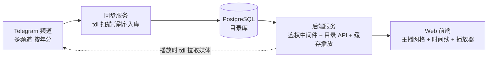
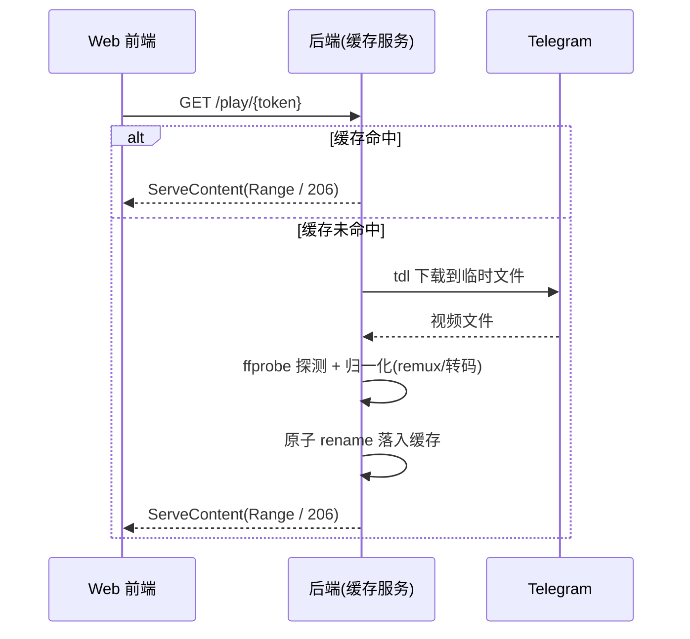

# 主播录播归档系统 · 架构设计

## 1. 背景与目标

我们把多名主播的直播录播上传到了 Telegram 频道(按年份分到不同频道),现在要做一个系统,让这些录播能被**浏览和在线播放**,而不必把全部视频长期落地存储。

核心目标:

- **存储开销可控**:不全量下载所有视频,按需拉取 + 容量受限的缓存。
- **网页访问**:浏览器直接播放,不依赖第三方媒体软件,不依赖原生客户端。
- **以主播为中心浏览**:用户按主播找录播,频道/年份只是后台的物理分区,对用户透明。
- **可扩展**:新增一年录播 = 配置一个新频道 + 跑一次同步。
- **全站密码保护**:本系统为个人自用,所有页面与 API 必须经过单一访问密码门禁,未登录不可见任何资源。

非目标(本期不做):多用户权限体系(但提供单用户密码门禁,见 §13)、原生 TV/移动端 App、复杂推荐。

## 2. 关键设计决策

设计过程中逐步收敛,最终放弃了两个早期方案,理由记录如下,供回顾:

| 决策         | 选择                              | 放弃的方案                  | 原因                                                         |
| ------------ | --------------------------------- | --------------------------- | ------------------------------------------------------------ |
| 媒体服务器   | 自建网页播放                      | Emby                        | Emby 带来 `.strm`/`.nfo`/封面文件生成、目录命名、扫描触发等一整套迁就成本;自有内容 + 网页访问场景下,这些都是负担。目录直接由数据库渲染更简单。 |
| 媒体获取方式 | tdl 下载 + LRU 缓存 + 静态服务    | 自研 MTProto 流式网关(gotd) | 自研支持 Range 的流式网关工作量大;改为下载完整文件后用标准静态服务器提供,HTTP Range(拖动)自动获得,tdl 也已处理好登录、大文件、`file_reference` 刷新、限速。 |
| 播放兼容性   | 缓存层统一归一化为 MP4(H.264/AAC) | 客户端 flv.js / mpegts.js   | 客户端库在 iOS Safari 的 MSE 支持不稳;服务端归一化后前端只面对 MP4,一个 `<video>` 通杀所有设备。 |

**主要取舍**:相比流式方案,下载缓存方案的代价是**冷文件首播延迟**(需等下载+归一化完成)。用缓存命中 + 后台预热来缓解;因为内容自有、数量有界,预热很可行。

## 3. 总体架构



系统由两条独立的数据流构成:

- **目录流(定时、离线)**:同步服务扫描 Telegram 频道历史,解析文件名,把元数据写入 PostgreSQL。它只写库 + 存缩略图,**不生成任何媒体文件**。
- **播放流(实时、按需)**:用户在网页点播,后端检查缓存;命中则静态直出,未命中则用 tdl 从 Telegram 下载、归一化、落盘后再返回。

## 4. 组件设计

### 4.1 同步服务(Sync)

定时任务(cron 或常驻 daemon),职责:

1. 遍历 `Channels` 表里 `Enabled = true` 的频道。
2. 对每个频道执行 `tdl chat export -c <channel> --with-content`,得到消息列表(message_id、文件名、上传时间、大小)。
3. 与 PG 中已有记录按 `(ChannelId, MessageId)` 做增量 diff,只处理新增/变更/删除。
4. 解析文件名 → `Streamer` / `RecordedAt`(见 §6)。
5. 拉取缩略图(MTProto 单独下封面,或后台用 ffmpeg 抽帧)。
6. UPSERT 进 PG,设置 `Status`。

新增一年录播,只需往 `Channels` 插一行再跑一次同步。

### 4.2 目录库(PostgreSQL)

两条流的交汇点,系统唯一的真相源。表结构见 §5。

### 4.3 后端服务(Backend)

两个职责合在一个服务里:

**目录 API**:读 PG,对外提供主播列表、某主播的录播时间线、搜索等接口。

**缓存播放服务**:对外暴露 `GET /play/{token}`,流程:



旁挂一个 LRU 协程管理缓存总大小(见 §8)。

### 4.4 Web 前端(Frontend)

三级页面:

1. **主播网格**:主播头像/名 + 录播数量。
2. **主播时间线**:该主播的所有录播按 `RecordedAt` 排序,**自动跨年份/频道合并**。
3. **播放页**:`<video src="/play/{token}">`,浏览器原生处理缓冲与拖动。

## 5. 数据模型

```sql
-- 频道配置：每个频道对应一年（或一组）录播
CREATE TABLE Channels (
    ChannelId  BIGINT  PRIMARY KEY,         -- Telegram 频道 id
    Label      TEXT    NOT NULL,            -- 比如 "2024"
    Enabled    BOOLEAN NOT NULL DEFAULT true
);

-- 录播条目：目录与播放的核心表
CREATE TABLE TelegramMedia (
    Id           BIGINT GENERATED ALWAYS AS IDENTITY PRIMARY KEY,
    ChannelId    BIGINT      NOT NULL REFERENCES Channels(ChannelId),
    MessageId    BIGINT      NOT NULL,
    FileName     TEXT        NOT NULL,                 -- 原始 Telegram 文件名（带冒号）
    FileSize     BIGINT      NOT NULL,
    MimeType     TEXT,
    DurationSec  INT,
    Streamer     TEXT,                                 -- 解析得出
    RecordedAt   TIMESTAMPTZ,                          -- 解析得出，排序/展示用
    UploadedAt   TIMESTAMPTZ NOT NULL,                 -- 消息上传时间，用于增量 diff
    StreamToken  TEXT        NOT NULL UNIQUE,          -- 资源稳定 ID(防枚举 MessageId);播放需登录后换签名 URL,见 §13.4
    ThumbPath    TEXT,
    Status       TEXT        NOT NULL DEFAULT 'pending', -- pending/ready/unparsed/stale/deleted
    CreatedAt    TIMESTAMPTZ NOT NULL DEFAULT now(),
    UpdatedAt    TIMESTAMPTZ NOT NULL DEFAULT now(),
    UNIQUE (ChannelId, MessageId)                      -- message_id 仅频道内唯一
);

-- 主查询是“某主播的录播按时间排”，此索引直接覆盖
CREATE INDEX ix_media_streamer_time ON TelegramMedia (Streamer, RecordedAt);

-- 可选：主播规范化，处理同一主播跨频道命名不一致
CREATE TABLE Streamers (
    Id          BIGINT GENERATED ALWAYS AS IDENTITY PRIMARY KEY,
    DisplayName TEXT NOT NULL,
    Avatar      TEXT
);
CREATE TABLE StreamerAlias (
    Alias      TEXT   PRIMARY KEY,                     -- 文件名里出现的原始主播名
    StreamerId BIGINT NOT NULL REFERENCES Streamers(Id)
);
```

说明:

- **不存 Telegram 的 `file_reference`**:它会过期,且由 tdl 在下载时实时解析,不该持久化。
- `StreamToken` 仅作为**资源内部 ID**(避免暴露 `MessageId`/物理路径)。它不是播放凭证——播放需登录用户用它向 API 换取一次性签名 URL,详见 §13.4。
- `Streamers` / `StreamerAlias` 命名规整时可暂不建,先 `GROUP BY Streamer`。
- **不引入用户表**:单用户密码门禁,session 走 HMAC 无状态 cookie(见 §13.2),无需 `Users`/`Sessions` 表。

跨年合并的目录查询:

```sql
SELECT * FROM TelegramMedia
WHERE Streamer = $1 AND Status = 'ready'
ORDER BY RecordedAt;     -- 不同频道/年份自动连成一条时间线
```

## 6. 文件名解析规范

上传命名约定:`{streamer}-%Y-%m-%d %H:%M:%S`(可能带扩展名)。

**坑**:分隔主播与日期用的是 `-`,日期内部也是 `-`,不能简单 split。正则应锚定结尾的时间戳,前面贪婪匹配主播名:

```python
import re
from datetime import datetime

PATTERN = re.compile(
    r'^(?P<streamer>.+)-(?P<ts>\d{4}-\d{2}-\d{2} \d{2}:\d{2}:\d{2})(?:\.\w+)?$'
)

m = PATTERN.match(original_filename)   # 用原始 Telegram 文件名，不是落盘后的名字
if m:
    streamer = m.group('streamer')
    recorded_at = datetime.strptime(m.group('ts'), '%Y-%m-%d %H:%M:%S')
else:
    pass  # 标记 Status='unparsed'，留待人工归类，不要静默丢弃
```

规则:

1. **在原始文件名上解析**。`%H:%M:%S` 含冒号,在 Windows/NTFS 非法,tdl 落盘时会经 filenamify 替换;缓存文件按 message_id 或哈希命名,与展示名解耦。
2. **解析失败标记不丢**:`Status='unparsed'`。

## 7. 媒体归一化

频道内现有格式:`mp4 / flv / ts`。HTML5 `<video>` 原生不能播 flv 和裸 ts,但三者内部编码绝大多数是 H.264 + AAC,只是容器不同。策略:**缓存层统一归一化为带 faststart 的 MP4**,前端只面对 MP4。

tdl 下完后按 ffprobe 结果分支:

```bash
# 探测
ffprobe -v quiet -print_format json -show_streams input.xxx

# mp4 + H.264/AAC：确保 moov 在前（可拖动）
ffmpeg -i input.mp4 -c copy -movflags +faststart output.mp4

# flv / ts + H.264/AAC：只换壳，秒级、无损
ffmpeg -i input.flv -c copy -movflags +faststart output.mp4
ffmpeg -i input.ts  -c copy -movflags +faststart output.mp4

# 内部为浏览器不认的编码（HEVC / 老 flv 的 VP6 等）：才真转码，吃 CPU
ffmpeg -i input.xxx -c:v libx264 -c:a aac -movflags +faststart output.mp4
```

要点:

- **`-movflags +faststart` 必加**:否则浏览器要整文件下完才能播、拖动会坏;ts→mp4 还顺带补全时长元数据。
- remux(`-c copy`)很快,首播按需做即可;真转码慢,应靠同步流后台**预热**。按现有格式构成(基本 H.264),真转码是极少数。

## 8. 缓存策略

- **总容量上限 + LRU 淘汰**:这是自研组件,tdl 本身没有缓存管理。维护索引(文件 → 大小 → 最后访问时间),写入新文件后若超阈值,按最久未访问删除至水位线以下。
- **原子写入**:tdl 先下到 `*.part`,归一化产出临时文件,完成后再 `rename` 到正式名,避免被读到半成品。
- **播放引用计数**:删除前确认该文件无进行中的播放会话,避免删掉正在看的。
- **预热**:同步流可后台预下最近/热门录播,提高热命中率,抵消首播延迟。

## 9. 关键技术点与坑

1. **必须用 MTProto 用户账号(tdl 即是),不能用 Bot API**:Bot API 下载单文件上限 20MB,视频拉不动。
2. **`file_reference` 会过期**:由 tdl 在下载时自动解析/重试,不持久化。
3. **FLOOD_WAIT 限速**:单账号高频拉取易被限速,需并发上限 + 退避重试;tdl 的 takeout 会话限速更宽松,可考虑。
4. **faststart**:见 §7,直接决定能否流畅播放和拖动。
5. **首播延迟**:见 §2 取舍,靠缓存 + 预热缓解。
6. **频道/年份对用户透明**:目录按主播组织,跨频道靠 `RecordedAt` 合并。
7. **登录暴力破解防护**:单一密码门禁是攻击面焦点。`/api/login` 必须限流(IP 级令牌桶,失败 5 次后锁定 15 分钟),进程内即可,无需 Redis。
8. **Secret 轮换的连锁影响**:`SESSION_SECRET` 轮换 ⇒ 所有 cookie 立即失效(等价强制下线,需重新输入密码);`PLAY_URL_SECRET` 轮换 ⇒ 已派发的签名播放 URL 全部失效(浏览器 `<video>` 会断,前端需感知 401/403 后自动重新换签)。两个 secret 独立,以便按需轮换。

## 10. 技术选型(建议,待定)

| 组件            | 建议                | 备注                                                         |
| --------------- | ------------------- | ------------------------------------------------------------ |
| 后端 + 缓存服务 | **Go**              | 高并发 IO,`http.ServeContent` 自带 Range,易 shell 调 tdl/ffmpeg |
| 同步服务        | Go 或 Python        | 批处理 + 文件名解析,两者皆可                                 |
| 目录库          | PostgreSQL          | 已有技术栈                                                   |
| 前端            | React / Vue         | 三级页面,HTML5 video                                         |
| 部署            | Docker              | 丢进 Synology Docker                                         |
| 鉴权            | bcrypt + HMAC-SHA256 | 密码哈希用 bcrypt(cost ≥ 12);session cookie 与播放 URL 用 HMAC 签名,Go 标准库即可,无需引入 OIDC 框架 |
| 依赖工具        | tdl、ffmpeg/ffprobe | 缓存服务内调用                                               |

**待定决策**:后端/同步服务用 Go 还是 Python;鉴权方案(token 形式、是否要登录);`Streamers` 别名表是否首期就建。

## 11. 部署形态(Docker)

- `postgres`:目录库,数据卷持久化。
- `sync`:同步服务,cron 触发,挂载 tdl 会话目录、缩略图目录。
- `backend`:目录 API + 缓存播放 + 鉴权中间件,挂载缓存目录(设容量上限),内置/可调用 tdl 与 ffmpeg。
- `frontend`:静态前端(也可由 backend 直接托管)。

共享卷:tdl 会话(严格 `0600` 权限,仅 backend/sync 挂载)、缩略图、视频缓存。

**必填环境变量清单**:

| 变量 | 含义 |
| --- | --- |
| `ACCESS_PASSWORD_HASH` | bcrypt 哈希(cost ≥ 12),由 `app hash-password` 生成 |
| `SESSION_SECRET` | 登录 cookie 的 HMAC 密钥,32+ 字节随机 |
| `PLAY_URL_SECRET` | 播放/缩略图 URL 的 HMAC 签名密钥,32+ 字节随机,独立于 session secret |
| `POSTGRES_DSN` 等 | 数据库连接 |
| `TG_API_ID` / `TG_API_HASH` | Telegram MTProto 接入凭据(tdl 使用) |

**HTTPS**:Cookie 标记了 `Secure`,因此外网部署必须 HTTPS;即便仅内网/Tailscale 也建议反向代理出 HTTPS,避免局域网窥探密码。

## 12. 可扩展性与后续

- **加新一年**:`Channels` 插一行 + 跑同步。
- **主播改名/别名**:启用 `Streamers` / `StreamerAlias`。
- **续播/进度**:在 PG 按 用户+视频 存播放位置。
- **字幕**:供应 `.vtt`。
- **转码预热**:对需真转码的文件做后台预处理队列。

## 13. 鉴权与会话设计

系统为个人自用,采用**单一共享密码 + 无状态 HMAC cookie + 短期签名播放 URL**三层组合。没有用户表,没有注册/找回密码流程——改密码靠改环境变量后重启。

### 13.1 密码与密钥配置

- `ACCESS_PASSWORD_HASH`:bcrypt 哈希(cost ≥ 12),只存哈希不存明文。
- `SESSION_SECRET`:登录 cookie 的 HMAC-SHA256 密钥,32+ 字节随机。
- `PLAY_URL_SECRET`:播放与缩略图 URL 的签名密钥,与 session secret **独立**,以便单独轮换(轮换它不会让用户被踢下线)。
- 配套一次性 CLI 子命令 `app hash-password`,读取 stdin 输出 bcrypt 串,避免把明文写进配置或 shell history。

### 13.2 登录流程与会话 cookie

```
POST /api/login    { password }
  → bcrypt.CompareHashAndPassword(ACCESS_PASSWORD_HASH, password)
  → 成功:Set-Cookie: sid=<base64(payload).hex(sig)>;
         HttpOnly; Secure; SameSite=Lax; Path=/; Max-Age=2592000
  → 失败:记入 IP 失败计数;返回 401
POST /api/logout   → 清 cookie
GET  /api/whoami   → 返回当前是否登录、cookie 剩余有效期
```

- Cookie payload(JSON 或固定结构):`{ issued_at, exp, nonce }`,`sig = HMAC-SHA256(SESSION_SECRET, payload)`。
- `exp` 默认 30 天;每次成功命中受保护接口时,若剩余 < 7 天则**滑动续期**(下发新 cookie)。
- 暴力破解防护:单 IP 失败 5 次后锁定 15 分钟,内存令牌桶即可(进程重启清零,可接受)。

### 13.3 中间件保护范围

| 路径 | 是否需登录 cookie | 备注 |
| --- | --- | --- |
| `/login` 静态页 / `/api/login` | 否 | 入口 |
| `/healthz` | 否 | 健康检查 |
| 静态前端资源(JS/CSS) | 否 | 内容非敏感;但首页 HTML 若内嵌列表数据,应改为登录后异步拉取 |
| `/api/*`(目录、搜索、换签 URL) | **是** | |
| `/admin/*`(tdl 登录、状态、缓存管理) | **是**,且未来如需升级可拆分 admin 密码 | |
| `/play/{token}?exp=&sig=` | **否,但要求签名有效** | 见 §13.4 |
| `/thumb/{token}?exp=&sig=` | 同上 | |

### 13.4 签名播放 URL

旧设计中 `GET /play/{StreamToken}` 直接播放,任何拿到 URL 的人都能下载——不可接受。改为两步:

1. **换签接口**(需登录 cookie):
   ```
   GET /api/media/{StreamToken}/play-url
     → 200 { url: "/play/{StreamToken}?exp=1735689600&sig=<hex>", exp: 1735689600 }
   ```
   服务端计算 `sig = HMAC-SHA256(PLAY_URL_SECRET, StreamToken | exp)`,`exp` 默认当前时间 + 30 分钟。
2. **播放接口**(不要求 cookie,只校验签名):
   ```
   GET /play/{StreamToken}?exp=...&sig=...
     → 校验 sig、exp 未过期 → 缓存命中?静态直出 : 触发下载/归一化
   ```

为什么播放接口不要求 cookie:浏览器原生 `<video>` 发起 `Range` 请求时 cookie 行为受 `SameSite` 与跨域影响,签名 URL 把鉴权信息塞进 query string 最稳。短 `exp` 限制了泄露风险(分享出去 30 分钟后失效)。

前端处理:`<video>` 触发 `error` 或 API 返回 403 时,自动重新调换签接口。

缩略图同样走 `/thumb/{token}?exp=&sig=`,签名 TTL 可放宽到几小时,平衡缓存命中与安全性。

### 13.5 不做的事

- 不引入用户表 / 角色 / 权限矩阵。
- 不做注册、找回密码、改密码 UI(改哈希后重启容器)。
- 不做 OAuth、第三方登录、2FA(密码 + HTTPS 对单人场景已足够)。

## 14. tdl 登录与会话管理

tdl 需要一个 Telegram 用户账号(MTProto),首次部署必须完成登录(短信验证码 + 可选 2FA),session 文件持久化后供同步与按需下载复用。

### 14.1 后台 Web 引导登录

路径 `/admin/tdl-login`(受访问密码 cookie 保护)。引导流程对应 tdl/gotd 的认证步骤:

1. **输入手机号** → 后端调用 tdl 的 auth.sendCode,Telegram 下发验证码,后端返回 `phone_code_hash` 与下一步 token。
2. **输入验证码** → 后端调用 auth.signIn;若返回 SESSION_PASSWORD_NEEDED:
3. **输入 2FA 密码**(若开启) → 后端调用 auth.checkPassword 完成认证。
4. 认证成功后 tdl session 文件落入挂载卷 `/data/tdl/`,UI 显示当前已登录手机号。

实现要点:每一步在后端持有短期的认证上下文(进程内 map + TTL),前端只传步骤 token,不直接接触 `phone_code_hash` 之类内部字段。

### 14.2 状态与失效感知

- `GET /admin/tdl-status` → `{ logged_in: bool, phone: string|null, last_used_at, last_error }`。
- 同步任务与按需下载在每次调用 tdl 失败时(AUTH_KEY_UNREGISTERED / SESSION_REVOKED 等),把 `last_error` 写库;前端检测到后在顶栏提示"需要重新登录 Telegram",指向 `/admin/tdl-login`。
- session 失效与播放失败解耦:已缓存的视频继续可播,只是新视频拉不到。

### 14.3 session 文件保护

- 容器内 `/data/tdl/` 卷文件权限 `0600`,仅 backend/sync 挂载,frontend 容器不挂。
- session 文件等价于 Telegram 账号凭证,**严禁**进入公开备份;若做备份须单独加密。
- 提供 `/admin/tdl-logout` 接口,实际清理 session 文件并强制下次重新登录(账号被盗或转移设备场景)。